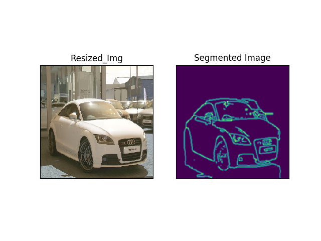
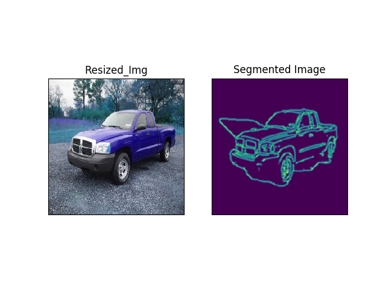
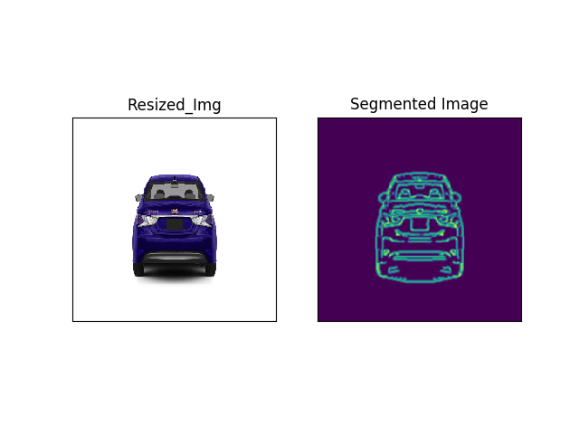
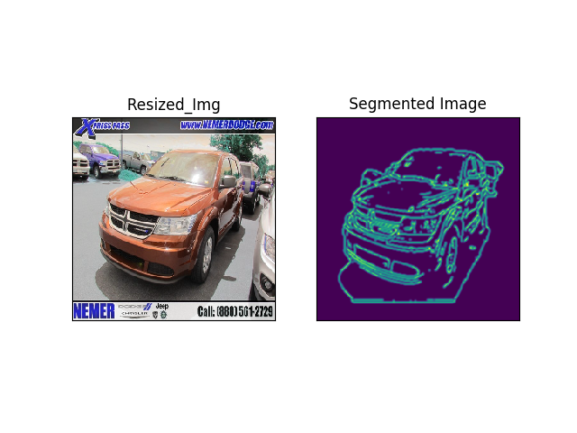
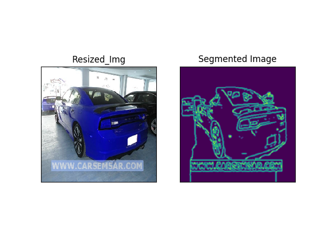

# Image-PreProcessing
# Segmented Version Of Images

*PreProcessing Algorithm In Action:*
(Although Seems To Be A Bit Buggy With Shadows, It Doesnt Effect Our Training Process Much, The Shadow's Noise Could Also Be Minimized Using Certain HSV Thresholding Techniques In CV2 Library)

